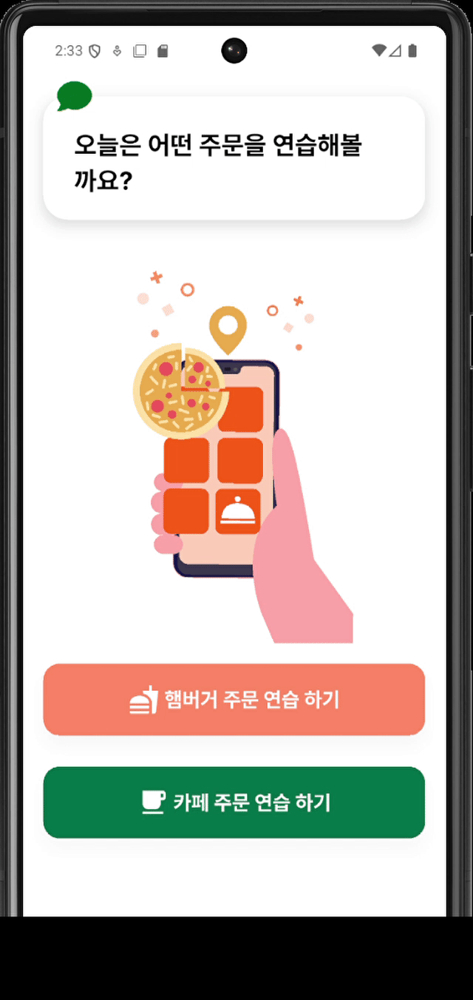
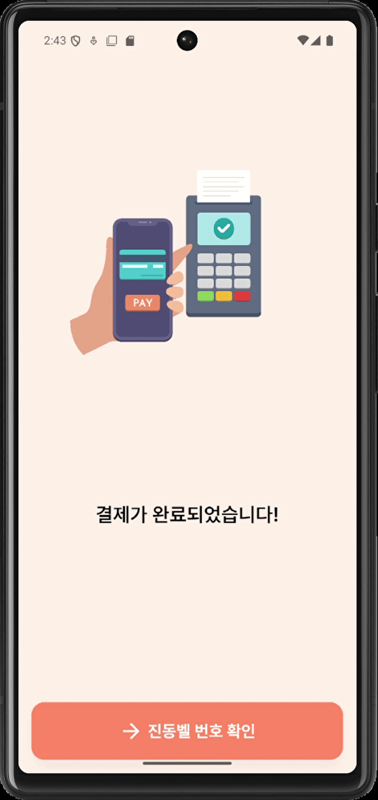
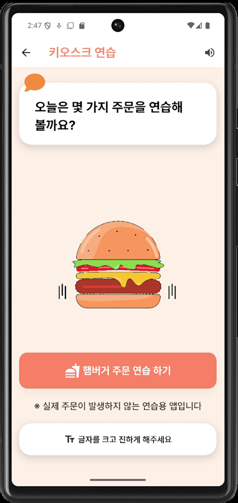

# 팀 키오스크 - Barrier-Free Kiosk App

디지털 소외 계층, 특히 고령층을 위한 **배리어 프리 키오스크 앱**입니다.  
키오스크의 급속한 확산에도 불구하고 고령층의 디지털 활용 역량은 여전히 낮아, 이를 돕기 위한 실질적인 해결책을 제시합니다.

---

## 📌 프로젝트 개요

- **목표**: 키오스크 사용에 어려움을 겪는 디지털 소외 계층을 위해, 직관적이고 접근성 높은 키오스크 UI/UX를 제공합니다.
- **배경**:
    - 2022년 기준, 70대 이상 디지털 정보화 수준은 전체 평균의 **34.6%**
    - 2019년 약 8,500대 → 2022년 **117,000대**로 보급 약 14배 증가
- **진행 기간**: 2025.04.28 ~ 2025.05.23
- **팀원**:
    - 이윤서 (팀장, 디자인/개발)
    - 김현수 (PPT 제작/개발)
    - 박성민 (발표/개발)

---

## 🧩 핵심 기능

- 🔲 **고대비 모드 / 큰 글씨 모드**  
  시력이 좋지 않은 사용자도 쉽게 인식 가능

- 🗣 **보이스오버 지원**  
  시각적 정보 인식이 어려운 사용자 보조

- 🎞 **직관적인 애니메이션**  
  단계별 안내와 자연스러운 전환 제공

  
  
  
  
  


- 🖥 **다양한 화면 크기 대응**  
  크롬 브라우저 및 다양한 에뮬레이터 환경 지원

- 🧪 **Golden Test 기반 테스트 자동화**  
  디자인/로직 변경 시 스냅샷 자동 비교로 안정성 확보

---

## 🛠 기술 스택 및 아키텍처

- **언어/프레임워크**: Flutter, Dart
- **상태관리**: Riverpod
- **아키텍처**: MVVM
- **기타 라이브러리**:
    - `lottie`
    - `syncfusion_flutter_signaturepad`
    - `cached_network_image`
    - `shorebird`

### 📁 폴더 구조

```
lib/
├── core/     # 공통 유틸, 위젯
├── data/     # API, 로컬 데이터
├── domain/   # 모델, 비즈니스 로직
├── view/     # UI 화면
```

---

## ✅ 테스트 및 품질 관리

- **Golden Test**
    - 위젯 렌더링 결과를 스냅샷 이미지로 저장
    - 변경사항 발생 시 자동 비교
- **CI 연동**: GitHub Actions  
  👉 [Golden Test 결과 확인](https://github.com/TeamKioskProject/team_kiosk/actions)

---

## 🚀 향후 계획

- 🎨 색맹·색약 사용자를 위한 색상 필터 기능
- 🔍 돋보기 및 UI 확대 기능
- 🌐 다국어 로컬라이징 (`easy_localization`)
- 🎤 마이크 입력 기반 음성 인식 기능 추가

---

## 📽️ 시연 영상

👉 https://www.youtube.com/watch?v=Ehebu9cghL4

---

이 프로젝트는 디지털 격차 해소를 위한 **실질적이고 직관적인 사용자 경험**을 제공합니다.  
모두가 편리하게 디지털 기술을 활용할 수 있는 사회를 지향합니다.
